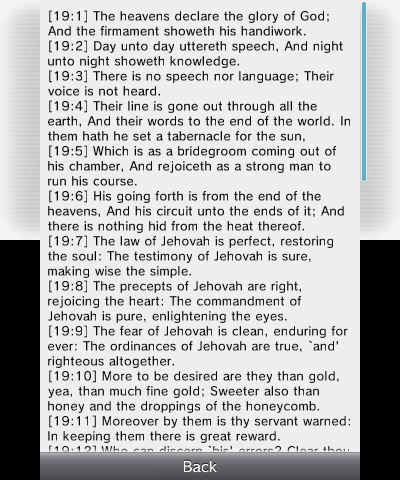

# Bible for 3DS



## Compiling

LDC has made this process simpler!

First, go [install devkitPro](https://devkitpro.org/wiki/Getting_Started) like normal. Make sure to install 3DS support!

Then, clone this repo.

```sh
git clone https://github.com/TheGag96/bible3ds
```

Go download/install the latest version of [LDC](https://github.com/ldc-developers/ldc). Make sure to add the `bin` folder to your path.

~~Copy the `base_rules` and `3ds_rules` files into `/opt/devkitpro/devkitARM`:~~

```sh
(DON'T DO THIS) sudo cp -r /path/to/repo/makescripts/* /opt/devkitpro/devkitARM
```

EDIT: Don't do this anymore! If you did this previously, revert those two files to their original versions.

Compile my extra build scripts:

```sh
cd /path/to/repo
./build_scripts.sh  # or build_scripts.bat on Windows
```

I've forked tex3ds, so go ahead and fetch its submodule:

```sh
git submodule update --init --recursive
```

Go try and build it. You may need to grab extra dependencies? Please contact me if you have trouble with this.

```sh
cd tools/tex3ds
./autogen.sh
./configure
make
mv tex3ds tex3ds.exe  # <-- do this line if on Linux/Mac only
cd ../../             # go back to root folder
```

Then, finally (and for every subsequent time building)...

```sh
make -j8  # or however many logical processors you have
```

If you need to recompile from scratch, or running `make` doesn't seem like it's doing what it should, just run:

```sh
make clean
make
```

## Thanks to...

* Wild for his minimal object.d from [PowerNex](https://github.com/PowerNex/PowerNex)
* [DevkitPro](https://devkitpro.org/)
* The devs of [libctru](https://github.com/smealum/ctrulib)
* The devs of [citro3d](https://github.com/fincs/citro3d)
* [dstep](https://github.com/jacob-carlborg/dstep) for C header file conversion
